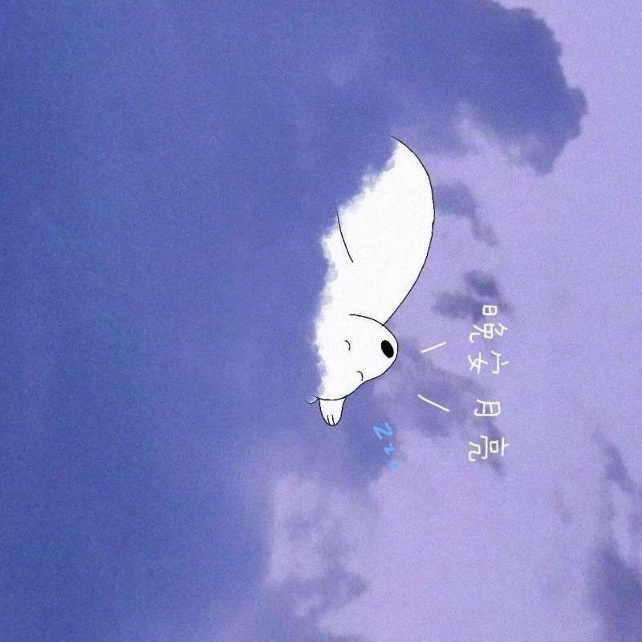

<!-- 如果你有自己的横幅图片，可以将其放在 `images/hero-banner.png` 并取消下面这行注释 -->
<!-- -->

# Hi there 👋，我是 **myRan**

  

- 🎓 **在读**：某中流211，计算机相关专业  
- 🔭 **研究方向**：深度学习（计算机视觉 CV）  
- 🌱 **正在学习**：PyTorch、OpenCV、算法与数据结构  
- 💬 **热爱**：刷 LeetCode、参与 Kaggle 竞赛、研读论文  
- 📫 **联系我**：myran.nuaa@gmail.com / myran_nuaa_cs@163.com  
- ⚡ **业余爱好**：跑步、摄影、旅行  

---

## 📊 我的 GitHub 数据

    
  

---

## 🔧 技术栈

  
  
  
  
  
  
  
  

---

## 📂 精选项目

| 项目名称 | 简介 | 技术栈 | 链接 |
| :------: | :--: | :----: | :---: |
| **myRan-ML** | 个人机器学习与深度学习实验仓库，包含 LeetCode 算法解答、Kaggle 项目笔记及计算机视觉小项目 | Python · PyTorch · OpenCV | [查看仓库](https://github.com/myRan-ML/myRan-ML) |
| **leetcode-solutions** | LeetCode 算法题刷题仓库，涵盖常见数据结构与算法题解 | C++ · Python | [查看仓库](https://github.com/myRan-ML/leetcode-solutions) |
| **kaggle-challenges** | Kaggle 竞赛项目合集，包含数据清洗、特征工程、模型训练与评估范例 | Python · Pandas · Scikit-Learn | [查看仓库](https://github.com/myRan-ML/kaggle-challenges) |

> **📌 Tip:** 想了解更多项目，可以点击我的 GitHub 个人主页，将你的访问固定在 “Repositories” 页面。  

---

## 🔗 社交 & 联系方式

- ✉️ 邮箱：myran.nuaa@gmail.com  
- 🌐 GitHub: [github.com/myRan-ML](https://github.com/myRan-ML)  
<!-- - 🔗 领英（LinkedIn）：[linkedin.com/in/your-profile](https://www.linkedin.com/in/your-profile) （可选）  
- 📚 Blog：<https://blog.example.com> （如有）  -->

---

> “Stay hungry, stay foolish.”  
> — *Steve Jobs*

---

> **更新日志：**  
> - 🚀 2025-05-31：优化个人 README，更新技术栈与精选项目。  
> - 🚀 2025-05-31：首次创建仓库。  

