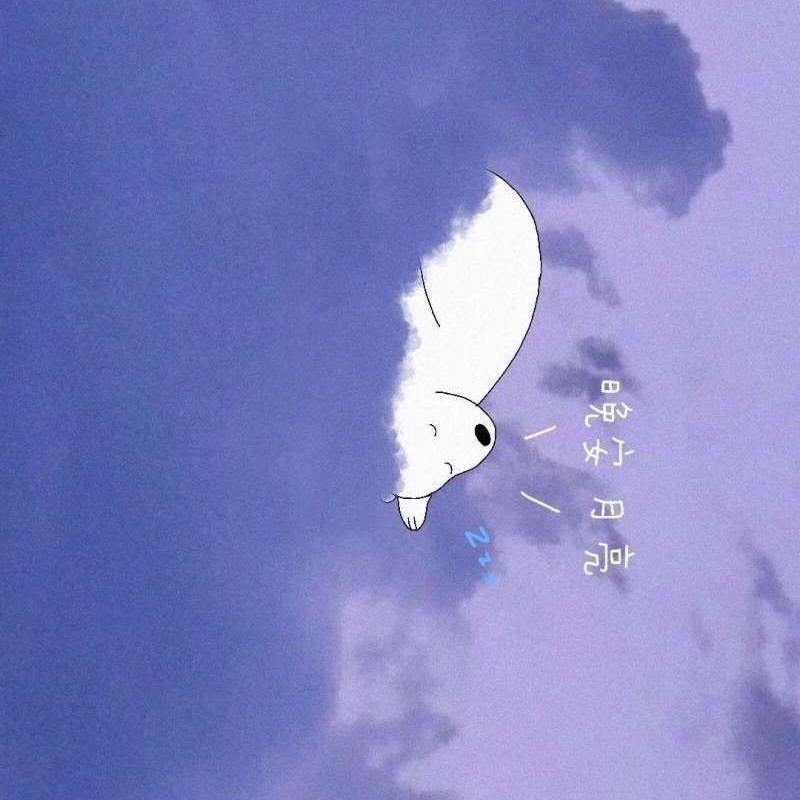

<!-- If you have your own banner image, place it at `images/hero-banner.png` and uncomment the line below -->
<!-- -->

# Hello 👋, I am **myRan**

  

- 🎓 **Currently Studying**: Computer Science & Artificial Intelligence
- 🔭 **Research Focus**: Deep Learning in Computer Vision, High Performance Computing
- 🌱 **Currently Learning**: PyTorch, OpenCV, Algorithms & Data Structures
- 📫 **Contact Me**: myran.nuaa@gmail.com / myran_nuaa_cs@163.com
- ⚡ **Interests**: Running, Photography, Travel

---

## 📊 GitHub Statistics

    
  

---

## 🔧 Technology Stack

  
  
  
  
  
  
  
  

---

## 📂 Featured Projects

| Project Name | Description | Technology Stack | Repository |
| :----------: | :---------: | :--------------: | :--------: |
| **Exp** | Personal machine learning and deep learning experimental repository, including LeetCode algorithm practice, Kaggle project notebooks, and computer vision projects | Python · PyTorch · OpenCV | [View Repository](https://github.com/myRan-ML/Exp) |
| **leetcode-solutions** | LeetCode algorithm problem-solving repository covering common data structures and algorithmic solutions | C++ · Python | [View Repository](https://github.com/myRan-ML/leetcode-solutions) |
| **kaggle-challenges** | Collection of Kaggle competition projects, including data preprocessing, feature engineering, model training, and evaluation examples | Python · Pandas · Scikit-Learn | [View Repository](https://github.com/myRan-ML/kaggle-challenges) |

> **📌 Note:** To explore additional projects, please visit my GitHub profile and navigate to the "Repositories" section.

---

## 🔗 Social Media & Contact Information

- ✉️ Email: myran.nuaa@gmail.com
- 🌐 GitHub: [github.com/myRan-ML](https://github.com/myRan-ML)
<!-- - 🔗 LinkedIn: [linkedin.com/in/your-profile](https://www.linkedin.com/in/your-profile) (Optional) -->
- 📚 Blog: [Personal Blog (Under Development)](https://myran-ml.github.io/)

---

> "Stay hungry, stay foolish."  
> — *Steve Jobs*

---

> **Update Log:**
> - 🚀 June 3, 2025: Maintaining daily LeetCode practice commitment
> - 🚀 May 31, 2025: Optimized personal README documentation
> - 🚀 May 31, 2025: Initial repository creation
